# Self-Driving Car Simulator

This is a Pygame-based self-driving car simulator that allows both **manual driving** and **AI-controlled autonomous driving** using **NEAT (NeuroEvolution of Augmenting Topologies)**. You can design custom race tracks, train AI agents to navigate them, and compare them with manual control in race mode.

---

## 🚗 Features

- **Manual Driving Mode**  
  Drive the car manually with realistic acceleration, steering, and collision feedback.

- **Self-Driving AI Mode**  
  The car learns to drive using NEAT. You can watch it evolve and improve each generation.

- **Race Mode**  
  Compete AI vs manual driving on the same track. See leaderboard updates in real time.

- **Map Editor**  
  Draw your own tracks using a spline-based editor. Add trees, save road layout, and generate start/finish metadata.

- **Multiple Car Models**  
  Switch between different car appearances with a single button in the UI.

- **Dropdown Menu System**  
  Easy access to switch between modes, maps, and exit with a clean, clickable UI.

- **Dynamic Camera & Collision System**  
  Follows the car and detects when the car leaves the road or crashes.

---

## 🗂️ File Structure

```
project/
│
├── cars/                  # Folder containing car images
├── maps/                  # Saved custom maps
├── startfinish/           # Start/finish metadata for each map
├── assets/                # UI assets (fonts, buttons, background)
├── finish/                # Finish Line marker(Future use)
├── sounds/                # Sound (Future Use)
│
├── auth.py                # Login, register, and password reset logic
├── button.py                # UI button class
├── car.py                 # Car class (movement, sensors, collision)
├── changecar.py           # Car switching logic
├── db.py                  # SQLite database (Score and user data handling)
├── main.py                # Entry point with splash screen and main menu
├── manual.py              # Manual driving mode
├── selfdriving.py         # NEAT-based AI driving
├── race.py                # Manual vs AI race mode
├── map_editor.py          # Map creation tool
├── utils.py               # Shared helper functions
├── viewdb.py              # View database(debugging purposes)
├── insert_dummy_data.py   # Insert dummy values (debugging purposes)
├── config.txt             # NEAT configuration
└── README.md              # This file
```

---

## ▶️ How to Run

Make sure you have **Python 3.7+** and the required packages installed:

```bash
install pygame neat-python pillow and all the packages
```

Then run the main menu with:

```bash
python main.py
```

---

## 🧠 Techniques Used

- **NEAT Algorithm (neat-python)**  
  Used to evolve neural networks to control the car using radar sensor input.

- **Catmull-Rom Splines**  
  Used in `map_editor.py` to create smooth track paths from user input.

- **Mask-based Collision Detection**  
  Pixel-perfect collision handling using Pygame's `mask.from_surface()`.

- **Radars for AI Perception**  
  Simulated line-of-sight sensors (rays) used by the AI to detect obstacles.

- **Modular Architecture**  
  Each mode is self-contained. Common logic is shared via `utils.py` and `changecar.py`.

- **Real-Time Leaderboard**  
  Tracks distances of AI and manual drivers and shows live leaderboard during races.

---

## ✅ Achievements

- Built a complete simulator with both manual and AI control.
- Implemented NEAT integration from scratch with generation restarts.
- Designed a custom map editor with drag-and-drop starting point.
- Created an interactive UI with dropdown menus and car selection.
- Made AI and manual cars compete fairly using same physics.
- Added features like respawning, finish line detection, and performance tracking.

---

## 📷 Screenshots and videos

--- 
### 🏁 Welcome Screen
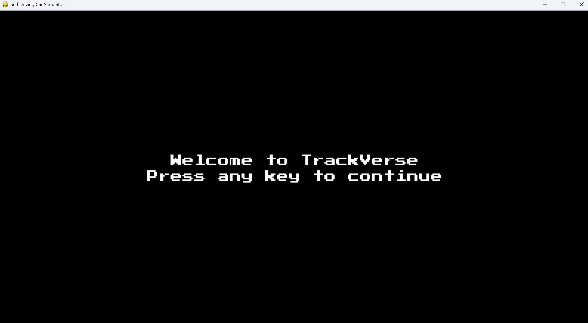
### 🏁 Admins Main Menu
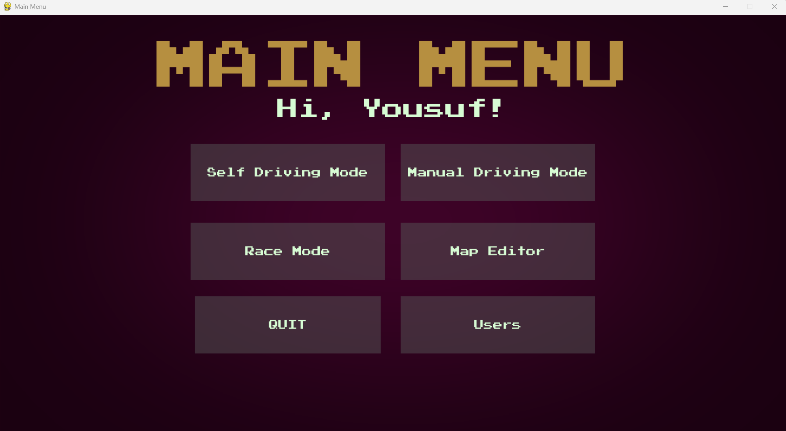
### 🏁 Main Menu
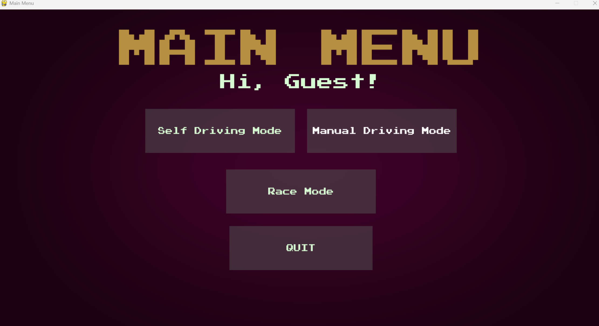
### Entry Screen
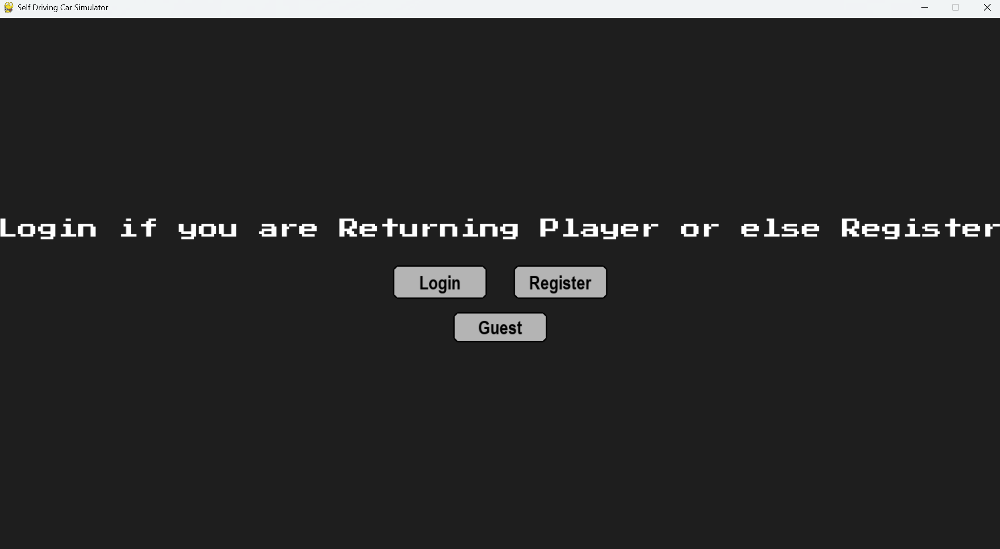
### Login Page
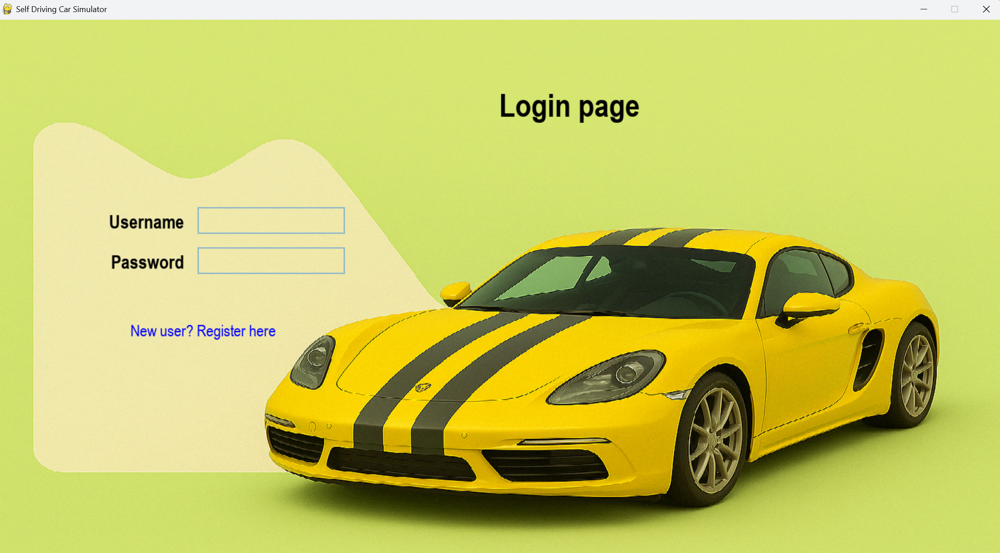
### Registration Page

### Manage user and map
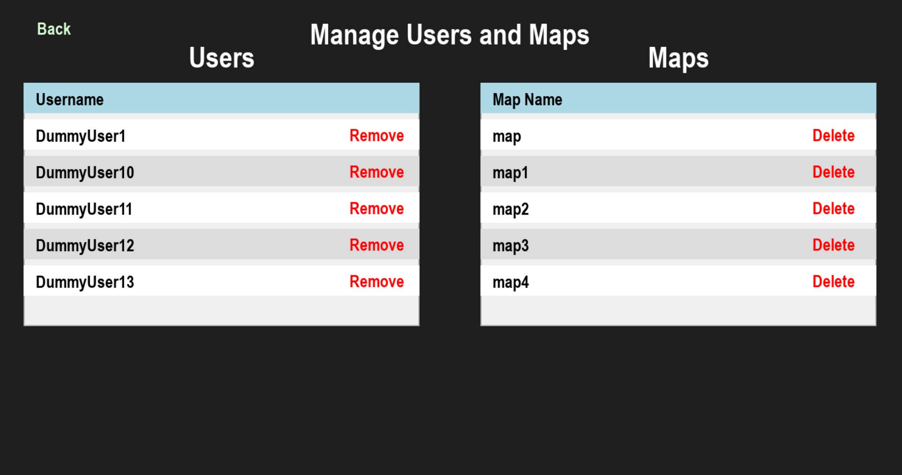
### Map selection Page
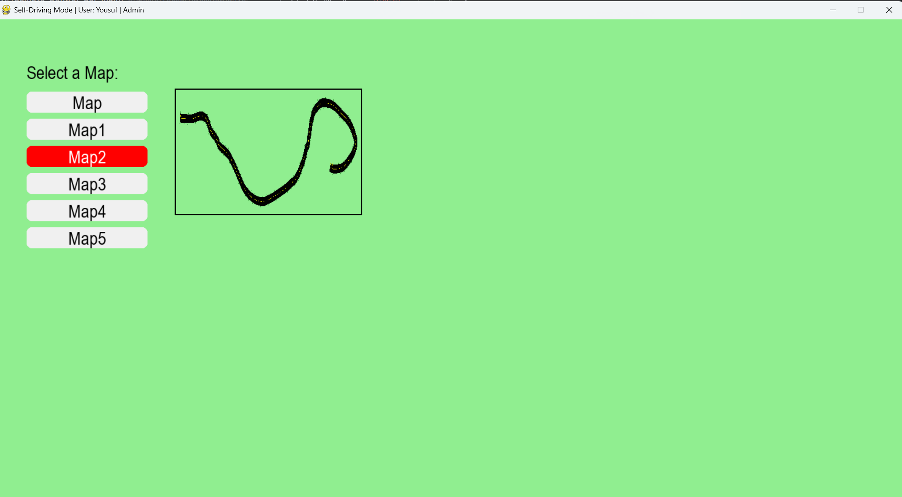

## 🎥 Demo Videos(click on the image to see the demo)

### 🤖 Self Driving Demo
[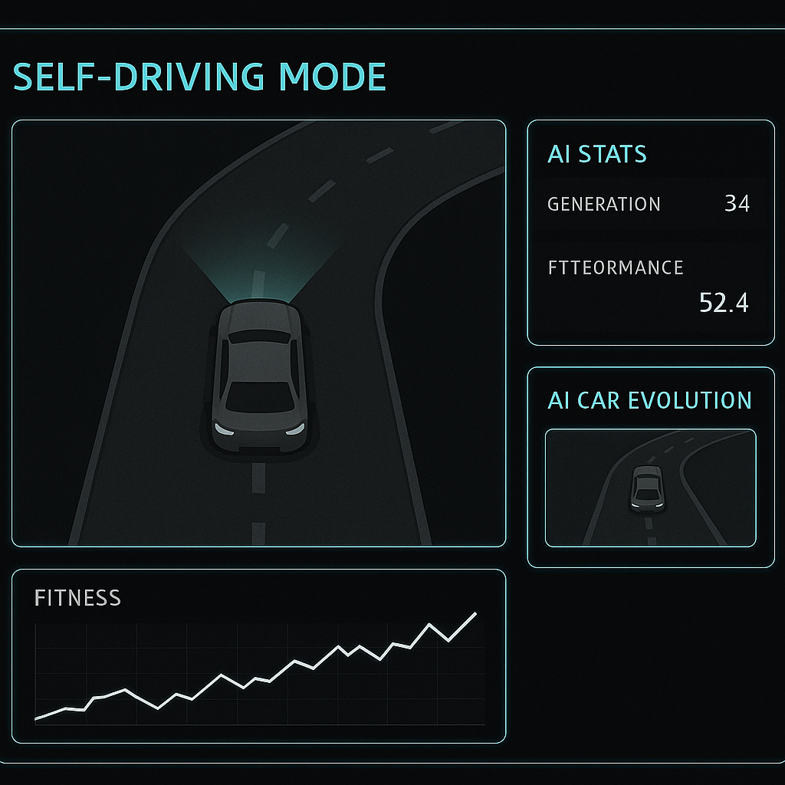](https://drive.google.com/file/d/1Xs5XI4Ds3l3FEuLCvunTwTFqoN8lFIyZ/view?usp=drive_link)

### 👨‍✈️ Manual Driving Demo
[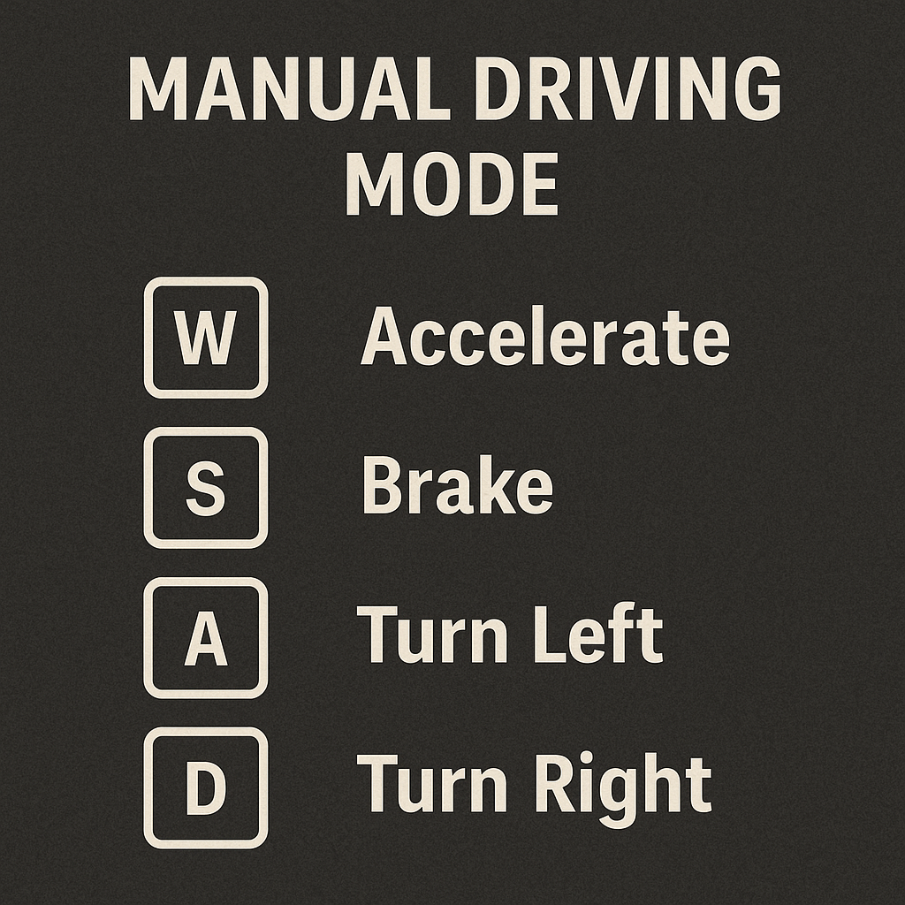](https://drive.google.com/file/d/1sBbAQ-SBAfGIIXGjvIFKJnYVjE0z5geH/view?usp=drive_link)

### 🏎️ Racing Demo
[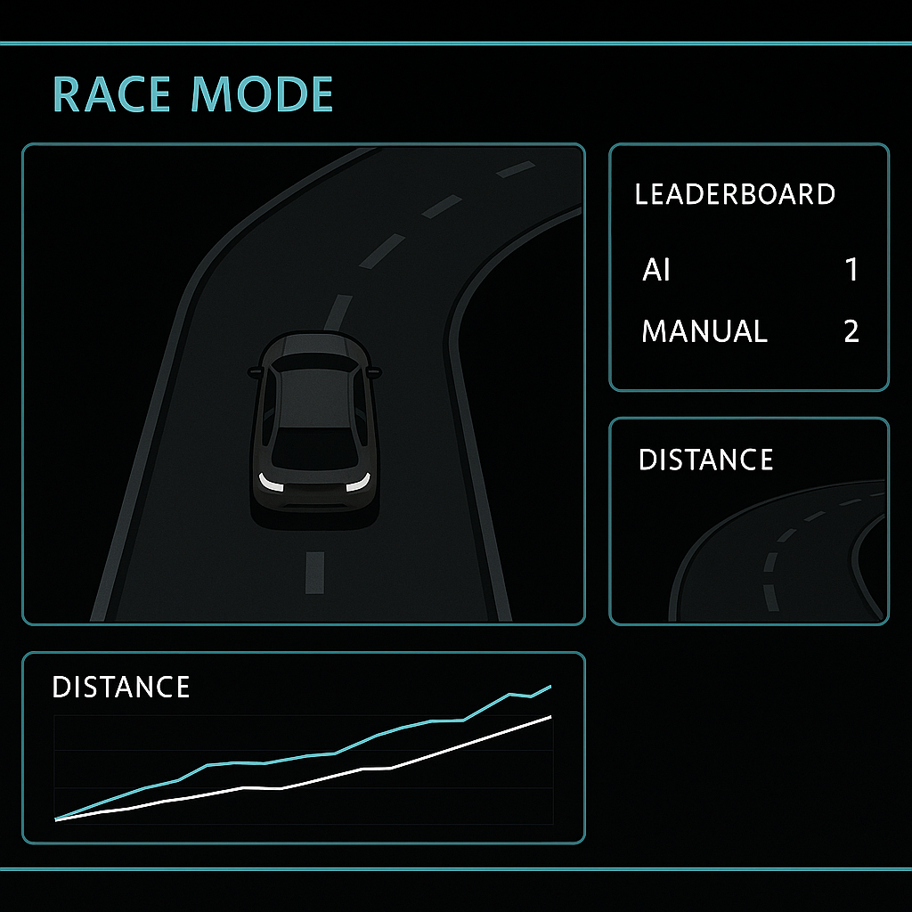](https://drive.google.com/file/d/1v3GLmLqrFK4Nsw5xw6MlwSLzKzEl15Vg/view?usp=drive_link)

###  🗺️  Map Editor Demo
[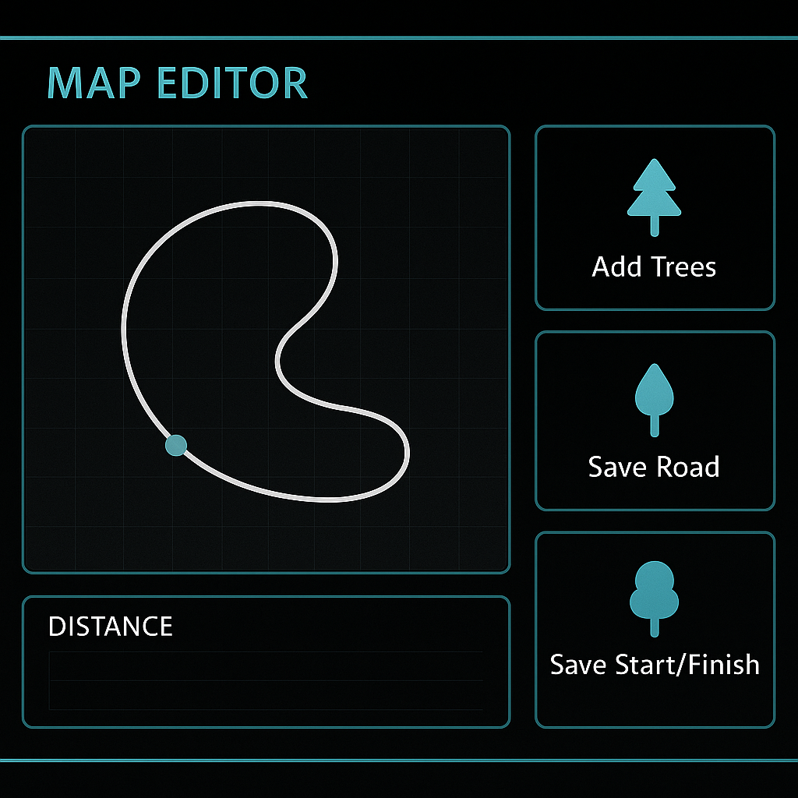](https://drive.google.com/file/d/1DeR_rScMX8qUTD53CG-qhX1VX3nPQqWP/view?usp=drive_link)

--- 

---

## 📩 Submission

Final Readme (Yousuf)